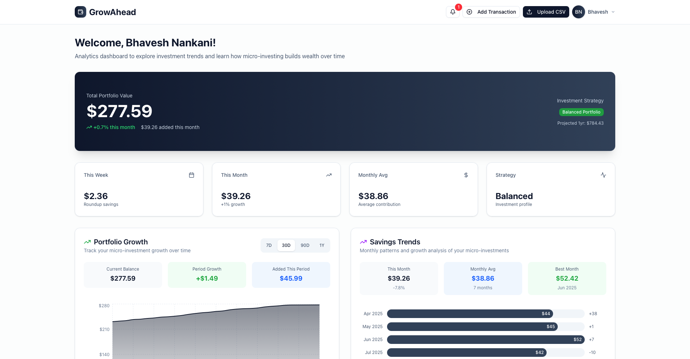
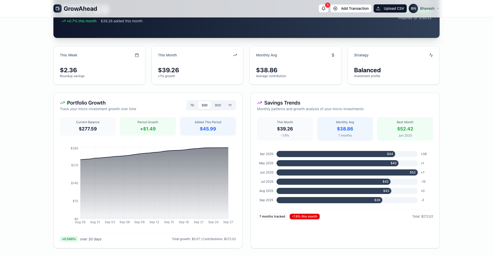
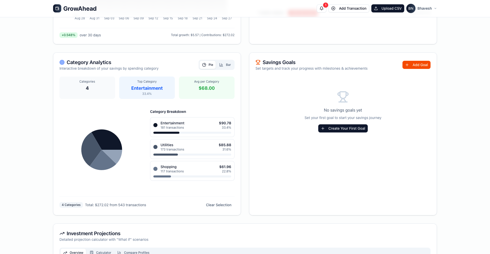
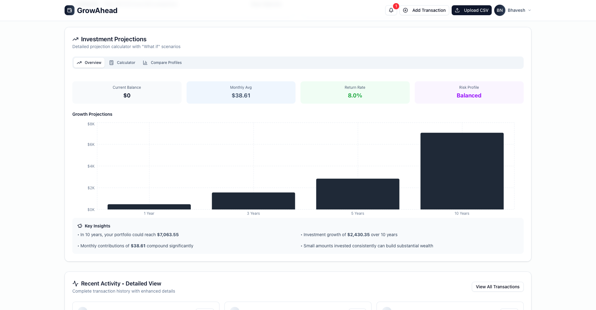
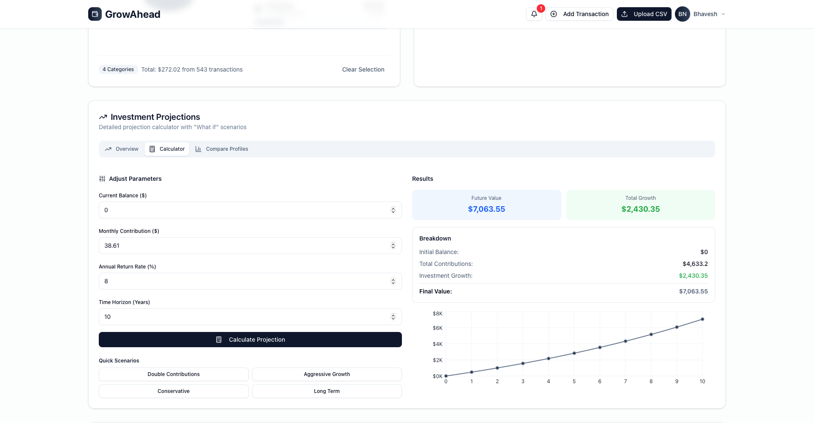
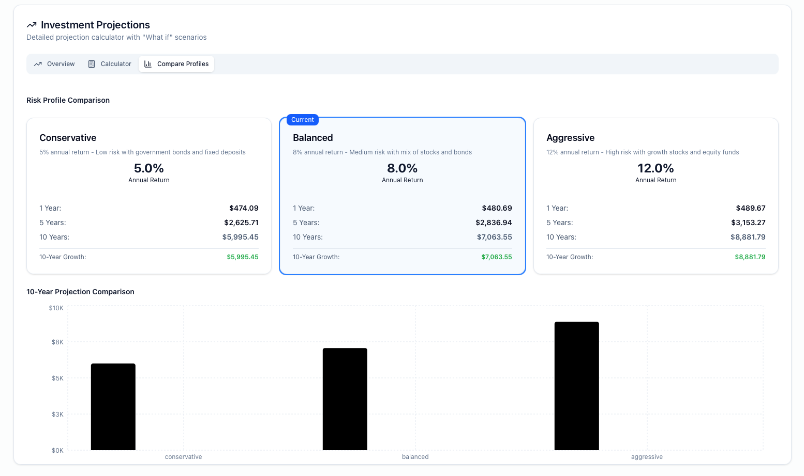
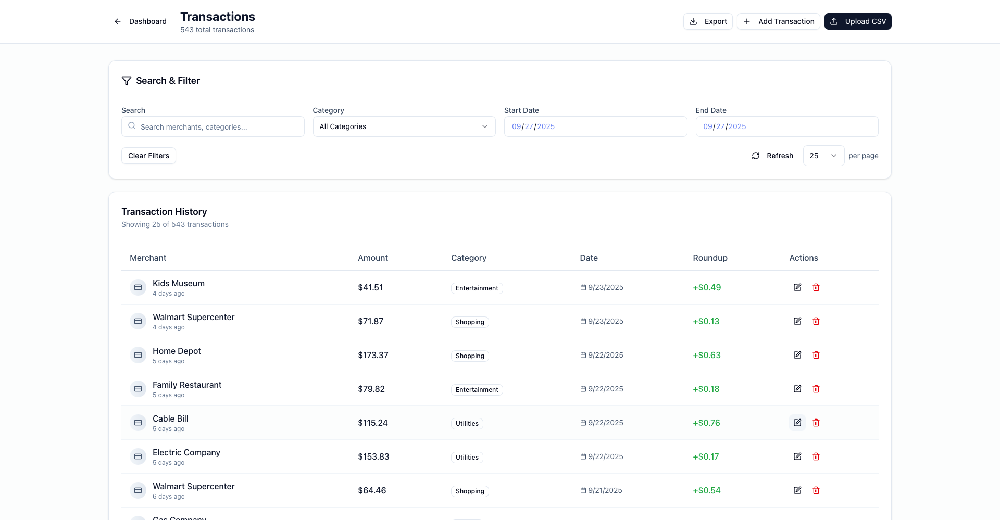
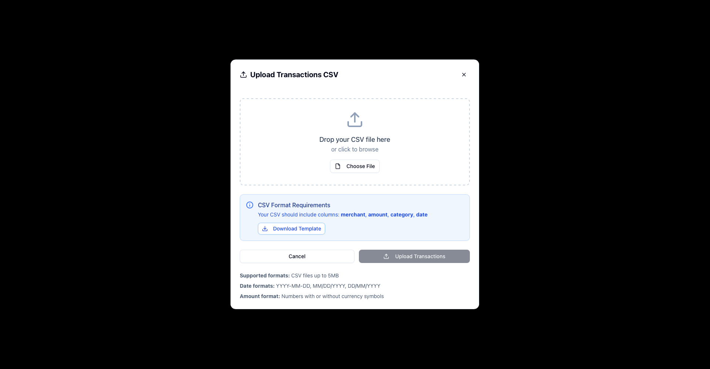
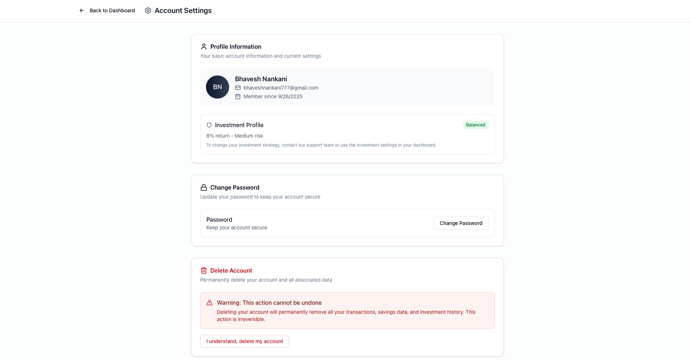

# GrowAhead - Micro-Investment Tracker

A full-stack fintech platform that simulates micro-investing through automated round-up calculations and portfolio projections.

## Live Demo
Frontend: https://growahead-beta.vercel.app  
Backend (Render): https://growahead-backend.onrender.com  
Backend (AWS): https://growahead-backend-dev.us-east-1.elasticbeanstalk.com  

## Application Overview

### Main Dashboard

### Portfolio Analytics

## Tech Stack
- Frontend: Next.js 15, TypeScript, TailwindCSS, Zustand, Recharts  
- Backend: Node.js, Express, PostgreSQL, JWT Auth, SendGrid  
- Deployment: Vercel, Render, AWS Elastic Beanstalk  

## Features

### User Authentication

- User authentication with email verification  

### Investment Analysis

- Transaction management + CSV upload  
- Automated round-up calculations  

### Investment Projections

- Investment projections with 3 risk profiles  
- Real-time dashboards and analytics  

### Transaction Management

### Account Management

## Setup

### Backend
cd Backend  
npm install  
cp .env.example .env  
# Fill in DB + SendGrid credentials  
npm start  
# Initialize DB at:  
http://localhost:5000/api/setup-database  

### Frontend
cd frontend  
npm install  
cp .env.example .env.local  
# Set NEXT_PUBLIC_API_URL=http://localhost:5000  
npm run dev  

## Environment Variables

### Backend (.env)
DB_HOST=localhost  
DB_PORT=5432  
DB_NAME=growahead  
DB_USER=your_username  
DB_PASSWORD=your_password  
JWT_SECRET=your-secret-key  
SENDGRID_API_KEY=your-sendgrid-key  
SENDER_EMAIL=noreply@yourdomain.com  
PORT=5000  

### Frontend (.env.local)
NEXT_PUBLIC_API_URL=http://localhost:5000  

## Features
- User authentication with email verification  
- Transaction management + CSV upload  
- Automated round-up calculations  
- Investment projections with 3 risk profiles  
- Real-time dashboards and analytics  

## API Endpoints
- /api/auth – Authentication  
- /api/transactions – Transaction management  
- /api/wallet – Wallet operations  
- /api/projections – Investment calculations  

---

After setup, visit: http://localhost:3000
