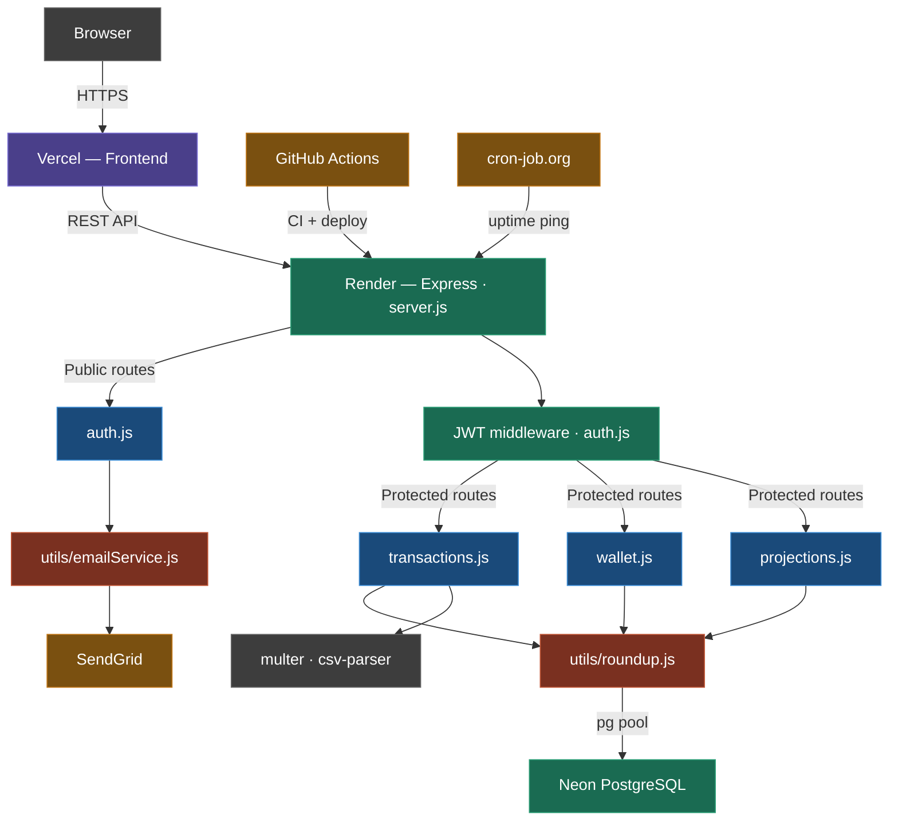
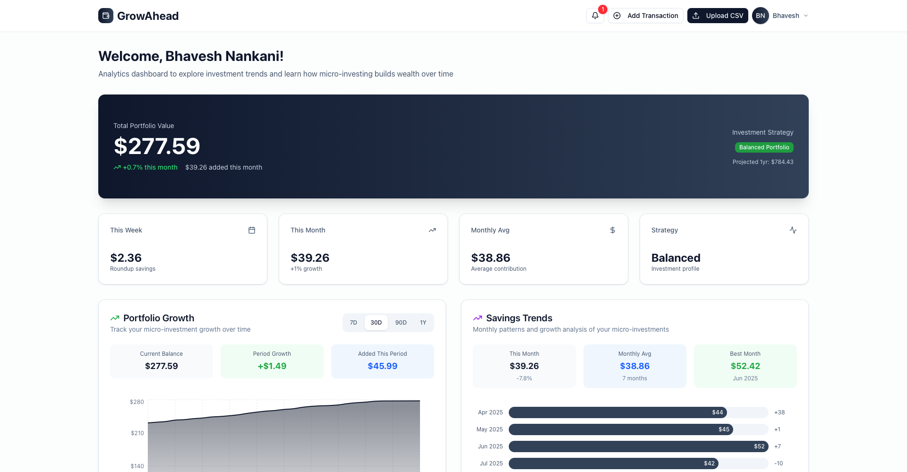
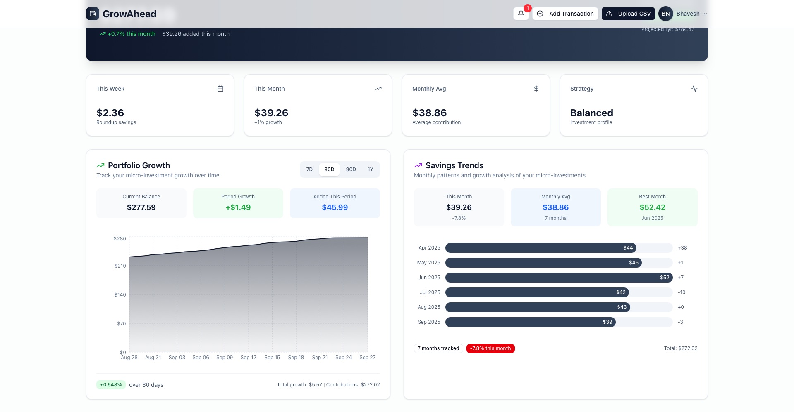
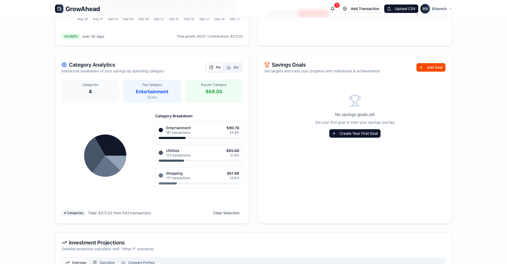
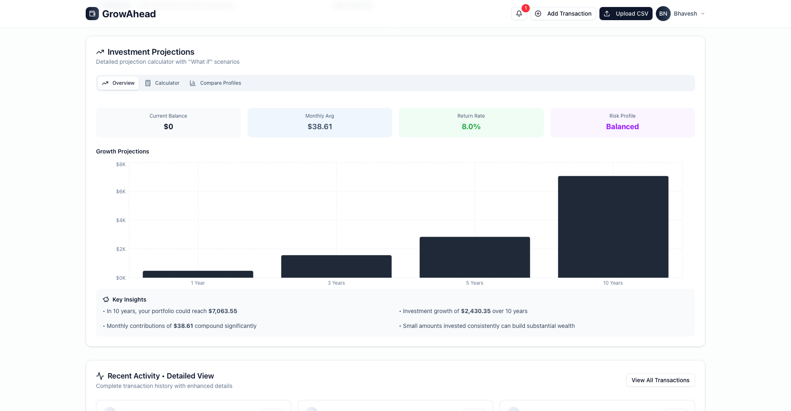
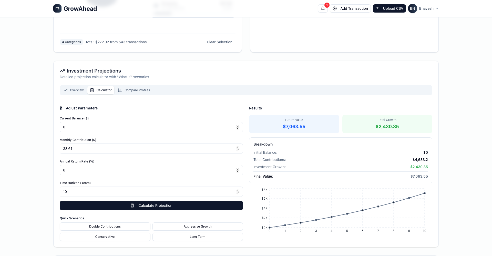
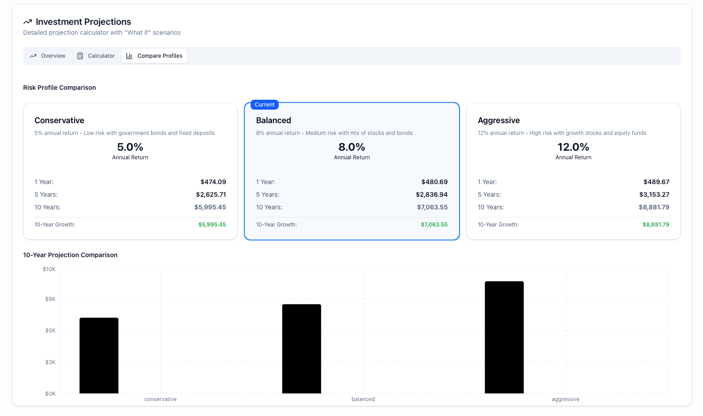
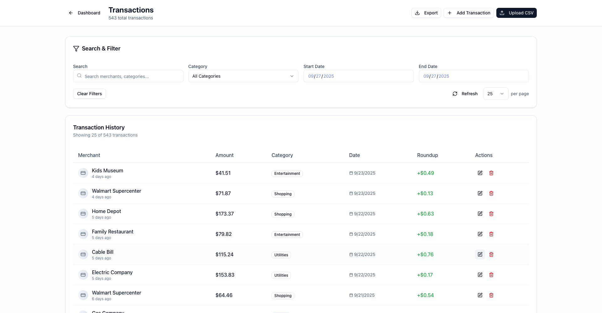
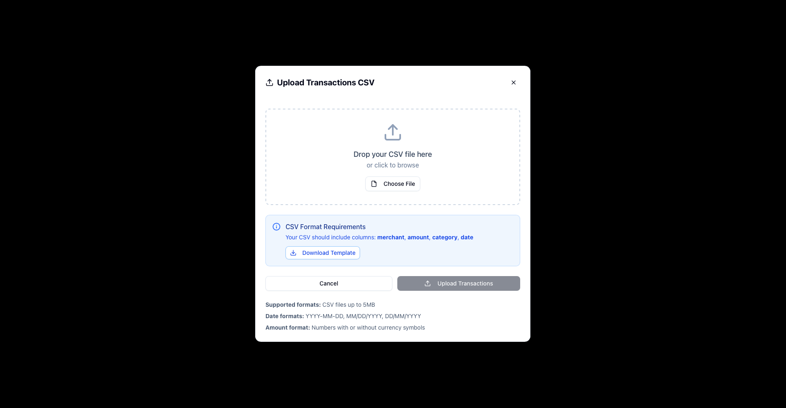
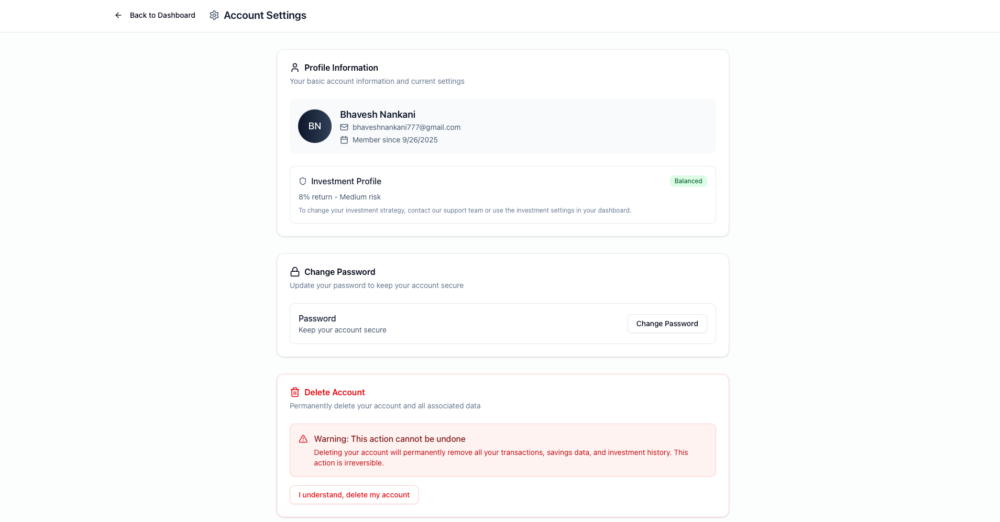

# GrowAhead — Micro-Investment Tracker

A full-stack fintech platform that simulates spare-change investing. Every transaction is rounded up to the nearest pound, and the difference is virtually invested across three risk profiles. Portfolio growth is calculated using time-weighted compounding — each roundup grows independently from the date it was created, not as a flat rate on total principal.

**[Live Demo](https://growahead-beta.vercel.app)**  &nbsp;|&nbsp; Demo account: `demo@growahead.com` / `Demo1234`

---


## Architecture
 

```mermaid
flowchart TD
    Browser["Browser"]
    Vercel["Vercel — Frontend"]
    Server["Render — Express · server.js"]
    JWT["JWT middleware · auth.js"]
    Auth["auth.js"]
    Transactions["transactions.js"]
    Wallet["wallet.js"]
    Projections["projections.js"]
    Roundup["utils/roundup.js"]
    Email["utils/emailService.js"]
    DB["Neon PostgreSQL"]
    SendGrid["SendGrid"]
    GHA["GitHub Actions"]
    Cron["cron-job.org"]
    Multer["multer · csv-parser"]
 
    Browser -->|HTTPS| Vercel
    Vercel -->|REST API| Server
    Server -->|Public routes| Auth
    Server --> JWT
    JWT -->|Protected routes| Transactions
    JWT -->|Protected routes| Wallet
    JWT -->|Protected routes| Projections
    Transactions --> Roundup
    Wallet --> Roundup
    Projections --> Roundup
    Auth --> Email
    Roundup -->|pg pool| DB
    Email --> SendGrid
    GHA -->|CI + deploy| Server
    Cron -->|uptime ping| Server
    Transactions --> Multer
 
    classDef gray fill:#3d3d3d,stroke:#666,color:#fff
    classDef purple fill:#4a3f8a,stroke:#7b6fd4,color:#fff
    classDef teal fill:#1a6b52,stroke:#2a9d75,color:#fff
    classDef blue fill:#1a4a7a,stroke:#3a8bd4,color:#fff
    classDef coral fill:#7a3020,stroke:#c05535,color:#fff
    classDef amber fill:#7a5010,stroke:#c07515,color:#fff
 
    class Browser gray
    class Vercel purple
    class Server,JWT,DB teal
    class Auth,Transactions,Wallet,Projections blue
    class Roundup,Email coral
    class SendGrid,GHA,Cron amber
    class Multer gray
```

---

## Application Overview

### Landing & Authentication


### Main Dashboard


### Portfolio Analytics



### Investment Projections




### Transaction Management



### Account Management


---

## Tech Stack

**Frontend**
- Next.js 15, React 19, TypeScript
- TailwindCSS, shadcn/ui
- Zustand (state management), Recharts (charts)

**Backend**
- Node.js, Express
- PostgreSQL, JWT authentication
- SendGrid (email verification)
- Decimal.js (financial arithmetic)

**DevOps & Deployment**
- Vercel (frontend), Render (backend), AWS Elastic Beanstalk (prior deployment)
- Neon (PostgreSQL cloud database)
- GitHub Actions (CI/CD)
- cron-job.org (uptime monitoring)

---

## Features

- Email-verified registration with OTP — unverified accounts cannot log in
- CSV upload for bulk transaction import, with per-row error handling
- Manual transaction entry with instant roundup calculation
- Three investment profiles: Conservative (5%), Balanced (8%), Aggressive (12%)
- Time-weighted portfolio growth — older roundups earn more than recent ones
- Portfolio history charts across 7D, 30D, 90D, and 1Y periods
- Investment projections over 1, 3, 5, and 10 years
- Category breakdown and savings trend analytics
- Risk profile switching with full portfolio recalculation

---

## Technical Architecture

### Roundup Engine
Every transaction amount is rounded up to the next whole pound. A £4.32 transaction generates a £0.68 roundup. Whole-number amounts (e.g. £5.00) generate a £1.00 roundup. All financial arithmetic runs server-side using Decimal.js to avoid JavaScript floating-point errors.

### Time-Weighted Growth
Each roundup compounds daily from its own `transaction_date`, not from when it was uploaded. This means a roundup created 12 months ago has grown more than one created last week — reflecting how real investments work. The formula applied per roundup is:

```
currentValue = principal × (1 + dailyRate) ^ daysInvested
dailyRate = annualRate / 365
```

Portfolio value is the sum of all individual roundup current values.

### Server-Side Financial Logic
All growth calculations, projections, and roundup arithmetic happen exclusively in the Express backend. The frontend receives computed values only — it never calculates money.

### Data Model
Two timestamps are stored per transaction: `transaction_date` (when the spending occurred) and `created_at` (when it was added to the database). Growth is calculated from `transaction_date`, so CSV uploads of historical transactions produce accurate retrospective growth.

---

## Testing

78 tests across 3 files, run with Jest and Supertest against a dedicated `growahead_test` database.

| File | Tests | Type | What it covers |
|---|---|---|---|
| `roundup.test.js` | 43 | Unit | `calculateRoundUp`, `calculateTimeWeightedGrowth`, `calculateCompoundInterest`, `calculateSavingsProjections`, `processTransactionRoundUps`, `validateAmount` |
| `auth.test.js` | 16 | Integration | Register validation, login validation, unverified user rejection, JWT authentication, `GET /me` |
| `transactions.test.js` | 19 | Integration | Auth guards, manual entry, roundup accuracy, CSV upload, data isolation between users, delete |

```bash
cd Backend
npm test
```

---

## CI/CD

Three GitHub Actions workflows run on every push to `main`:

**Continuous Integration** — installs dependencies, lints, builds the Next.js app, and runs all 78 backend tests. Fails the pipeline if any test fails.

**Security Audit** — runs `npm audit` on both frontend and backend to flag vulnerable dependencies.

**Deployment** — deploys the frontend to Vercel and triggers a Render backend redeploy automatically on a successful push.

---

## API Endpoints

| Method | Endpoint | Auth | Description |
|---|---|---|---|
| POST | `/api/auth/register` | — | Register and send OTP |
| POST | `/api/auth/verify-email` | — | Verify OTP and activate account |
| POST | `/api/auth/login` | — | Login and receive JWT |
| GET | `/api/auth/me` | ✓ | Get current user |
| PUT | `/api/auth/profile` | ✓ | Update name or risk profile |
| PUT | `/api/auth/password` | ✓ | Change password |
| DELETE | `/api/auth/account` | ✓ | Delete account |
| GET | `/api/transactions` | ✓ | List transactions with filters and pagination |
| POST | `/api/transactions` | ✓ | Add single transaction |
| POST | `/api/transactions/upload-csv` | ✓ | Bulk import via CSV |
| PUT | `/api/transactions/:id` | ✓ | Edit transaction |
| DELETE | `/api/transactions/:id` | ✓ | Delete transaction |
| GET | `/api/wallet/summary` | ✓ | Portfolio value and growth metrics |
| GET | `/api/wallet/history` | ✓ | Portfolio history for charts |
| GET | `/api/wallet/stats` | ✓ | Category breakdown and savings trends |
| GET | `/api/projections` | ✓ | 1, 3, 5, 10 year projections |

---

## Local Setup

### Prerequisites
- Node.js 20+
- PostgreSQL 16

### Backend

```bash
cd Backend
npm install
cp .env.example .env
# Fill in database credentials and SendGrid API key
npm start
```

### Frontend

```bash
cd frontend
npm install
cp .env.example .env.local
# Set NEXT_PUBLIC_API_URL=http://localhost:5000
npm run dev
```

Visit `http://localhost:3000`

### Environment Variables

**Backend `.env`**
```
DB_HOST=localhost
DB_PORT=5432
DB_NAME=growahead
DB_USER=your_username
DB_PASSWORD=your_password
JWT_SECRET=your-secret-key
SENDGRID_API_KEY=your-sendgrid-key
SENDER_EMAIL=noreply@yourdomain.com
PORT=5000
```

**Frontend `.env.local`**
```
NEXT_PUBLIC_API_URL=http://localhost:5000
```